# VMoney - Personal Finance & Currency Converter

VMoney is your personal finance companion, built with Flutter. It makes it easy to track expenses, convert currencies in real-time, and manage your money on the go. Its offline-first design means your data is always safe and accessible, with a seamless experience on both Web and Mobile.

**Note:** The source code for this project is private, but you can explore the fully functional web application via the live demo link above.

## 📱 Get the App

For the best experience on your mobile device, native applications are in development.

|                                                                    Android (Coming Soon)                                                                    |                                                                      iOS (Planned)                                                                       |
| :---------------------------------------------------------------------------------------------------------------------------------------------------------: | :------------------------------------------------------------------------------------------------------------------------------------------------------: |
|                                 The official VMoney app for Android is being prepared for release on the Google Play Store.                                 |                                  An iOS version is planned for release on the Apple App Store. Stay tuned for updates.                                   |
|  |  |

## 📸 Screenshots

<!-- Replace these placeholder links with actual paths to your screenshots in the repository. -->
<!-- For example:  -->

  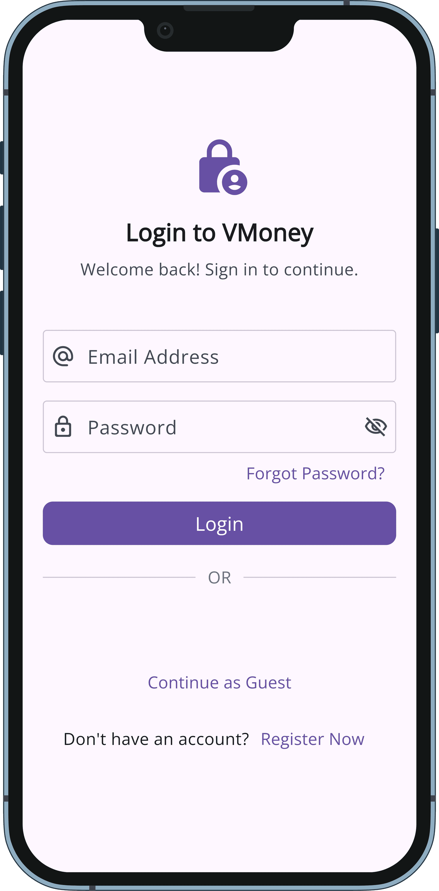
   
  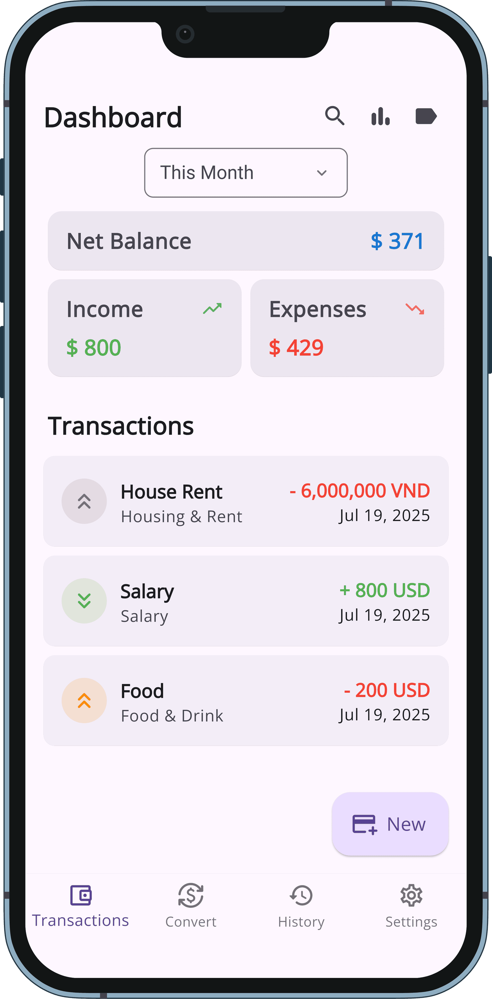
    
  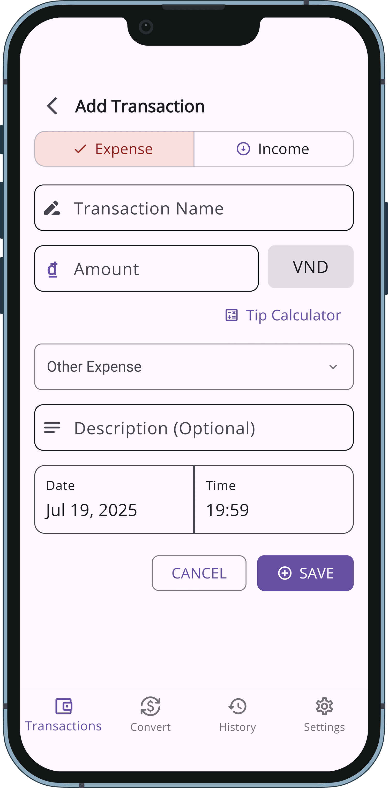
   
  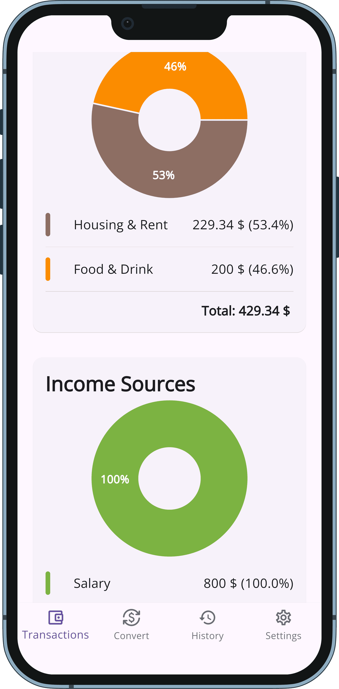

  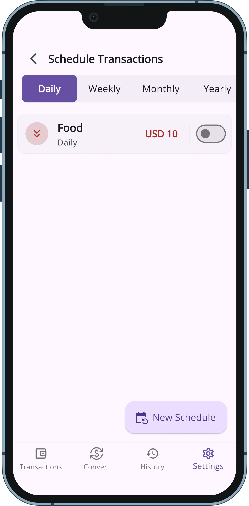
   
  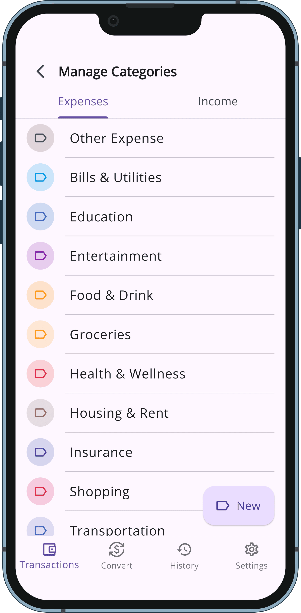
    
  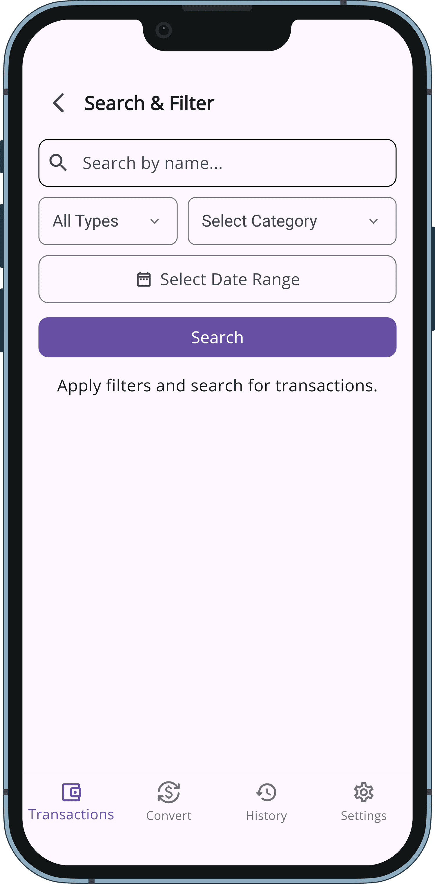
   
  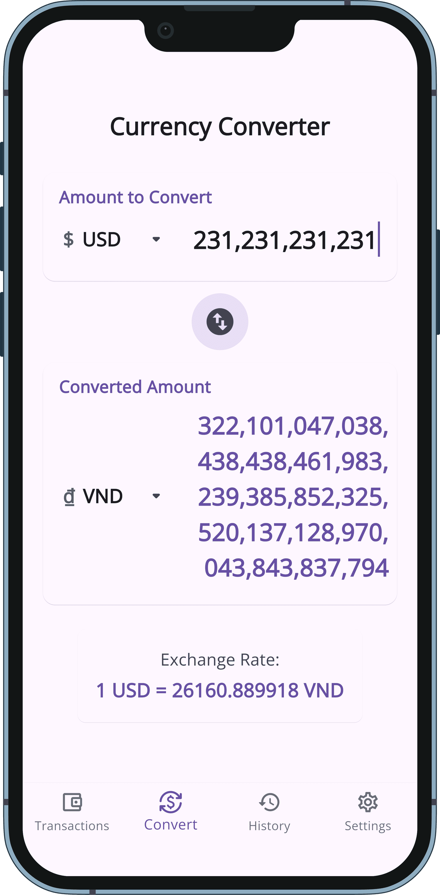

  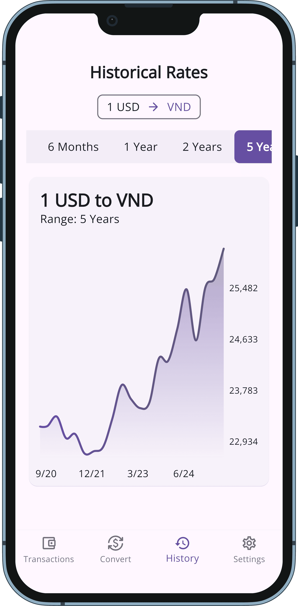
   
  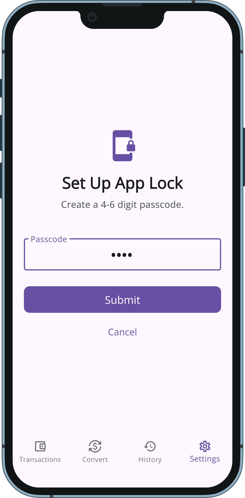
    
  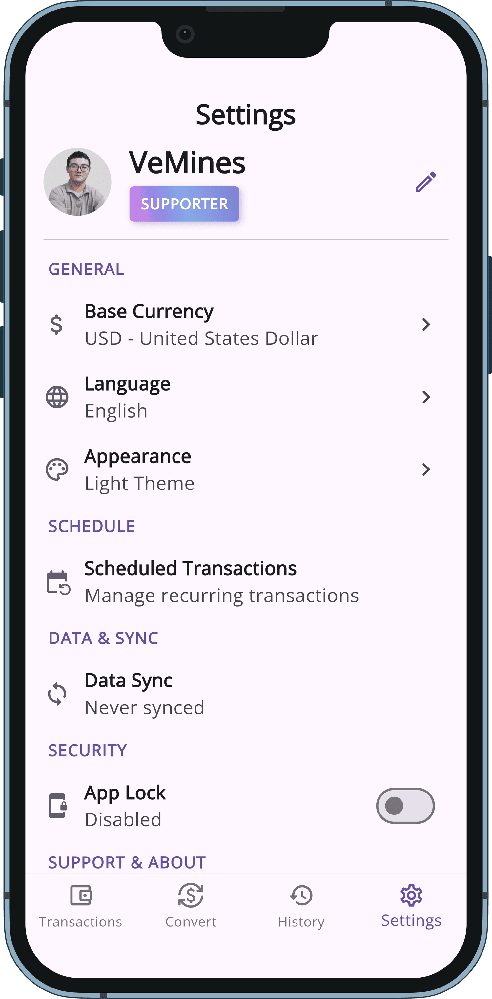
   
  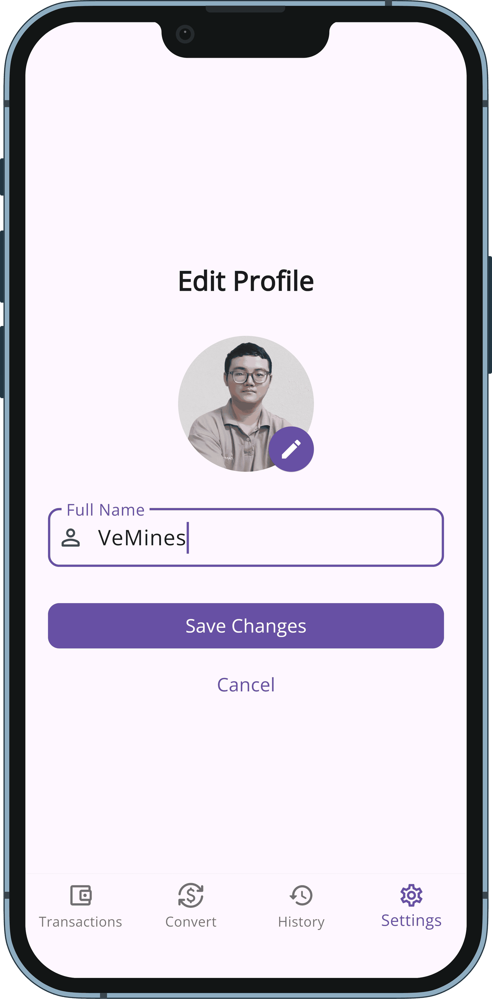

  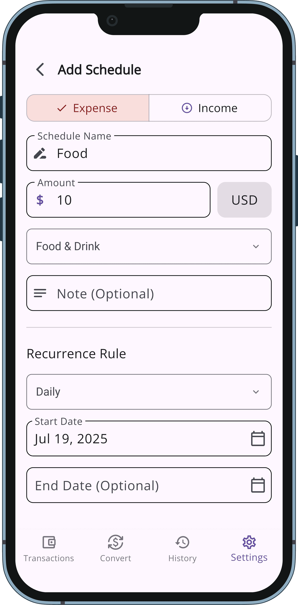
   
  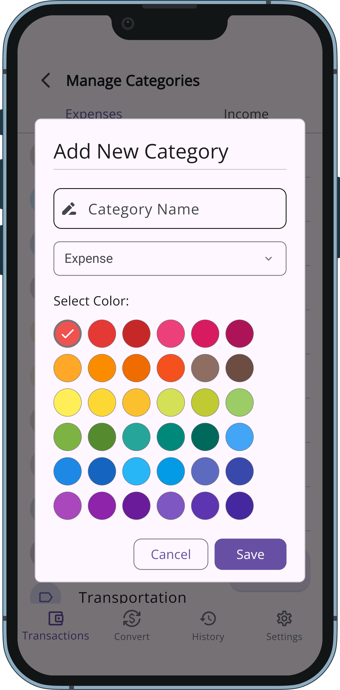
    
  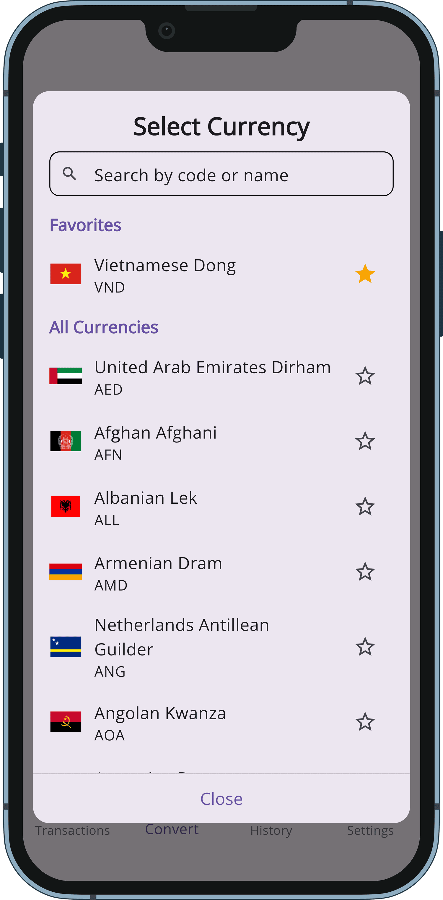
   
  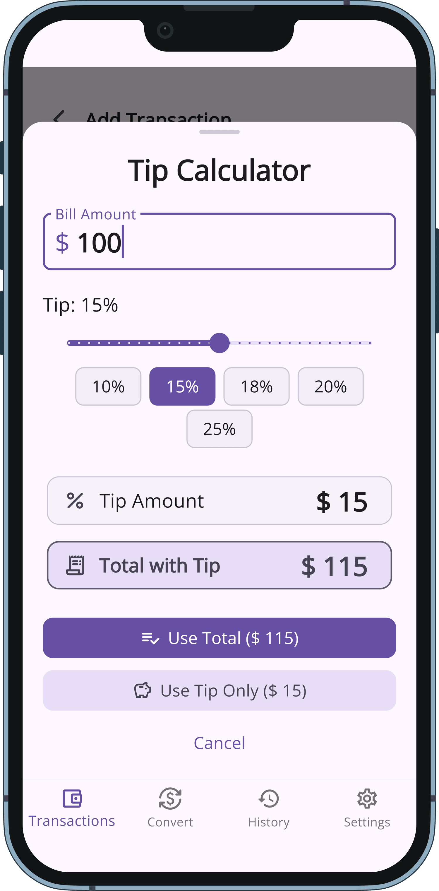

## ✨ Key Features

### 💰 Core Finance

- **Comprehensive Tracking:** Log expenses and income with fully customizable categories and detailed notes.
- **High-Precision Calculations:** Utilizes the `Decimal` package to prevent floating-point errors in all financial calculations.
- **Transaction Scheduling:** Automate recurring transactions (daily, weekly, monthly, yearly) to streamline data entry.
- **Insightful Reports:** Visualize financial breakdowns by category with interactive pie charts, powered by `fl_chart`.

### 🔒 Data & Security

- **Secure Authentication:** Multiple sign-in options including Email/Password, Google, and a full-featured Guest mode.
- **Offline-First Architecture:** The app is fully functional offline (Guest mode). All changes are stored locally in an SQLite database and queued for synchronization.
- **Intelligent Data Synchronization:** When online, local changes are seamlessly pushed to the cloud, and remote data is pulled, ensuring consistency across devices.
- **Conflict Resolution:** A robust system detects and allows the user to resolve data conflicts that may arise from editing the same item on multiple devices while offline.
- **Local App Lock:** Secure your data with a local passcode, featuring a progressive lockout mechanism after multiple failed attempts.

### 🌎 User Experience

- **Real-Time Currency Converter:** Convert between 150+ world currencies with rates that are updated automatically.
- **Historical Rate Charts:** Analyze currency trends over time with interactive historical data charts.
- **Responsive UI:** A single codebase delivers a tailored experience for mobile, web, and desktop layouts.
- **Internationalization (i18n):** Built with localization support for multiple languages. (WIP)
- **Dynamic Theming:** Seamlessly switch between Light and Dark themes.

### monetisation (Mobile Planned)

- **Monetization Ready:** Architected to support future implementation of In-App Purchases and Subscriptions.
- **Ad Support:** Designed for optional AdMob integration, which can be disabled by supporters.

## 🛠️ Tech Stack & Tools

| Category                        | Technology / Library                                                     |
| :------------------------------ | :----------------------------------------------------------------------- |
| **Language & Framework**        | `Flutter` `Dart`                                                         |
| **Architecture**                | Clean Architecture                                                       |
| **State Management**            | `Bloc`, `Cubit`, `bloc_concurrency`                                      |
| **Backend as a Service (BaaS)** | `Supabase` (Authentication, Postgres DB, Storage, RPC Functions)         |
| **Local Storage**               | `SQLite` (via `sqflite`), `Shared Preferences`, `Flutter Secure Storage` |
| **Routing**                     | `GoRouter`                                                               |
| **Dependency Injection**        | `GetIt`                                                                  |
| **Networking**                  | `Dio`                                                                    |
| **Functional Programming**      | `Dartz`                                                                  |
| **Data Visualization**          | `fl_chart`                                                               |
| **Utilities**                   | `Intl` (Localization), `Decimal` (High-Precision Math), `equatable`      |

## 🚀 Deployment

The web version of this application is built and deployed automatically to **GitHub Pages**.

### Currency Data Automation (CI/CD)

A GitHub Actions workflow runs on a schedule. It executes a `Node.js` script that fetches the latest currency exchange rate data from a public API, formats it, and commits the updated data files back into the repository. This ensures the app's currency information is always up-to-date without manual intervention.

**[Github Link](https://github.com/vemines/money-exchange/tree/main)**

## 🏃 How to View the Demo

As the source code is private, the best way to experience VMoney is through the live web build.

1.  Click the **[Live Demo](https://vemines.github.io/vmoney/)** link at the top of this page.
2.  For a quick start, select **"Continue as Guest"** to explore the app's features with a local, device-only session.
3.  Alternatively, register a new account to test the cloud synchronization capabilities.
